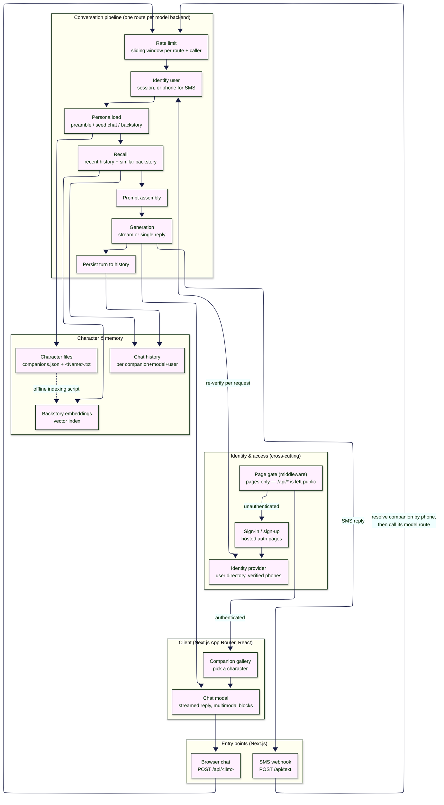
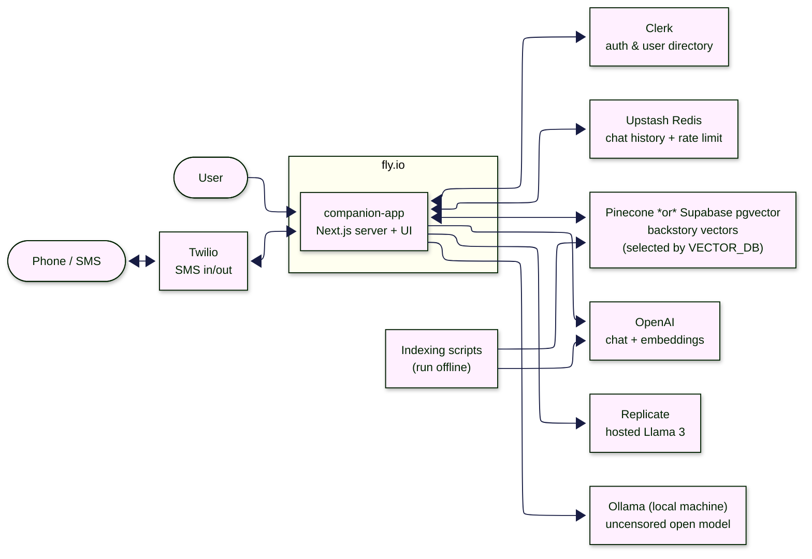
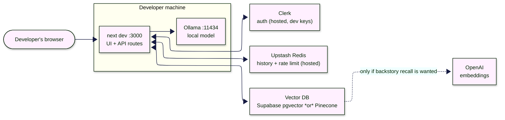

# Architecture

AI companion chat app: pick a character, talk to it in the browser or by SMS, and it answers in persona with memory of what you've said before.

## Application architecture

Four product features and two cross-cutting concerns, layered on one shared conversation pipeline.

**Features**

| Feature | What it does |
| --- | --- |
| Companion catalog | A registry file plus one text file per character defines the whole cast. A character file holds a short always-on persona *preamble*, a *seed chat* that bootstraps a new user's history, and a *backstory* that is embedded for retrieval. |
| Model dispatch | Each character declares which model backend it uses; that name **is** the API route. Adding a backend means adding a route — no other wiring. |
| Memory | Short-term: the last turns of that user's conversation. Long-term: semantic lookup over the character's backstory, scoped so companions never retrieve each other's. Memory is keyed by companion + model + user, so changing a character's model starts a fresh conversation. |
| Channels | Web chat streams tokens into a multimodal renderer (text / image / audio / video blocks). SMS reuses the same pipeline and returns a single message instead of a stream. |
| Identity & access | Two enforcement points, deliberately. Middleware gates the *pages* and redirects anonymous visitors to hosted sign-in / sign-up; it marks the API surface public, so every route **re-verifies the caller itself** before doing any work. Browser callers are resolved from the session, SMS callers by verified phone number. |
| Rate limiting | A sliding window of 10 requests / 10 s, keyed by route URL + caller, applied as the first step of every entry point. Cross-cutting, but the key includes the route, so each model backend has its own budget per user. |

## Service architecture

The app is a single deployed Next.js service; everything else is an external managed service, except the local model backend.

**Service responsibilities**

| Service | Role | Notes |
| --- | --- | --- |
| Next.js app (fly.io) | UI, API routes, prompt assembly, orchestration | Stateless; character files ship with the build and are read from disk at request time |
| Clerk | Authentication, user identity, phone verification | Also the lookup table for the SMS channel |
| Upstash Redis | Conversation history and rate-limit counters | History is never expired or cleared automatically |
| Pinecone / Supabase pgvector | Backstory similarity search | One or the other, chosen by config; embeddings must be built with the same embedding model the app queries with |
| OpenAI | Chat completions and embeddings | Also used by the offline indexing scripts |
| Replicate | Hosted Llama 3 backends | Cold starts can be slow; replies arrive as one chunk, not streamed |
| Ollama | Local, uncensored model backend | Runs on the developer's machine, so this backend is unavailable to a cloud deployment |
| Twilio | Inbound SMS webhook and outbound replies | The only non-browser channel |

*Note:* the text-to-image modal posts to an image route that does not exist in this repo; the feature is inert.

### Minimum local setup

Running on localhost drops every service that exists only to serve the public deployment: no hosting, no SMS channel, no hosted model providers. What remains is the irreducible set — the app cannot start a conversation without an authenticated user, a history store, a constructible vector-DB client, and one model backend.

| Service | Required? | Why |
| --- | --- | --- |
| Ollama (local) | Yes — or another backend | The only model backend that needs no third-party account. Use a companion whose `llm` is `ollama`. |
| Clerk | Yes | Sign-in gates the app and every route re-verifies the user; there is no anonymous path. Development keys are enough. |
| Upstash Redis | Yes | Conversation history and rate limiting; both are called on every request, and the client is constructed from env at startup. Upstash is reached over HTTP, so it cannot be swapped for a plain local Redis without a code change. |
| Vector DB config | Yes, in practice | Backstory recall itself degrades gracefully — a failed lookup just yields an empty `relevantHistory`. But the client is constructed eagerly when the memory layer initialises, so missing config throws before the graceful path is reached. Point it at a local Supabase/Postgres with pgvector to keep it on-machine. |
| OpenAI | No | Only used for embeddings. Without it, vector search fails, is caught, and companions answer from persona plus recent history alone. Needed only to run the indexing scripts and get backstory recall. |
| Replicate, Twilio, fly.io | No | Hosted Llama backends, the SMS channel, and hosting — all deployment-only. |

Net effect of the minimum setup: browser chat with persona and short-term memory works fully offline apart from auth and history; long-term backstory recall and the SMS channel do not.

## Architectural concerns

This is a demo-grade codebase. The list below maps the places where the implementation departs from what a production system would do, so that code which looks illogical can be read as *known-suboptimal* rather than misunderstood. Nothing here is a bug report — none of it is claimed to be intentional or accidental, only that it is undocumented and load-bearing.

### Trust boundaries

- **The API surface is deliberately unauthenticated at the edge.** Middleware gates pages but marks `/api(.*)` public ([middleware.ts:7](../src/middleware.ts#L7), with an in-code TODO). Every model route therefore re-implements its own auth. The consequence is not just duplication: the gate and the checks can drift independently, and a new route that forgets the check is publicly open with no signal.
- **The SMS bypass is an authorization hole.** A model route accepts `isText: true` plus a caller-supplied `userId` and trusts it, verifying only that such a user *exists* — not that the caller is that user ([chatgpt/route.ts:42-51](../src/app/api/chatgpt/route.ts#L42-L51), same in every route). Combined with the public API surface, anyone who learns a user id can converse as them and write into their history. The check reads like authentication but performs none.
- **The Twilio webhook is unauthenticated.** [/api/text](../src/app/api/text/route.ts) never validates the Twilio request signature, so the `From`/`To` fields — the sole basis for identifying both the user and the companion — are attacker-controlled. This is the entry point that mints the trusted `userId` above.
- **Rate limiting is per-route, not per-user.** The key is request URL + user id ([rateLimit.ts:12](../src/app/utils/rateLimit.ts#L12)), giving each caller an independent budget on every model backend and on the SMS webhook. Whether that is intended or a side effect of using the URL as a convenient unique string is not recorded.

### Duplication and coupling

- **The conversation pipeline exists once per backend, by copy-paste.** The four model routes are near-identical ~250-line files differing only in the model call. Any change to auth, memory, prompt shape, or error handling has to be made four times. The "adding a backend is just adding a route" property is real, but its cost is that the route *is* the pipeline.
- **Dispatch is by string convention across three places.** A companion's `llm` field, the route folder name, and the `modelName` literal inside the route must all agree. Nothing validates this. The `modelName` is also part of the Redis history key, so a rename silently orphans every existing conversation instead of failing.
- **The embedding model is a hand-synced constant.** [memory.ts](../src/app/utils/memory.ts#L11) and both indexing scripts must name the same model. A mismatch does not error — it returns meaningless nearest neighbours. The coupling is commented but not enforced.
- **Prompts are assembled by string concatenation** from character files, retrieved backstory, and user input, with per-route stop-token workarounds compensating for weaker models. There is no separation between instruction and untrusted content.

### Data lifecycle

- **Chat history is unbounded and permanent.** Redis keys are never expired, capped, or deleted; removing a user's conversation means opening the Upstash console. There is no delete path, no export, and no retention policy for what is by nature personal conversational data.
- **History is write-only from the UI's perspective.** The server accumulates every turn but exposes no read endpoint, so the client can only ever display the current exchange. The stored history exists solely to feed the prompt.
- **Character content and its index drift independently.** Editing a backstory has no effect until the indexing script is re-run, and there is no version, checksum, or staleness signal linking the two.

### Configuration and failure behaviour

- **Config is read ad hoc, not validated at startup.** Each route and script calls `dotenv.config()` itself and reaches into `process.env` with non-null assertions. Missing configuration surfaces as a runtime throw deep inside a request rather than a refusal to boot.
- **Optional dependencies fail like required ones.** Vector search degrades gracefully when a *query* fails, but the vector-DB client is constructed eagerly in the memory singleton's constructor ([memory.ts:37-55](../src/app/utils/memory.ts#L37-L55)), so absent config throws before the graceful path can apply. The intended optionality is defeated by construction order.
- **Errors are logged, not reported.** Failures are caught and `console.log`ged throughout; the user sees a hang or an empty reply. There is no structured logging, error tracking, or health signal — which is why the README notes that backends "fail silently, especially when deployed".
- **Per-request client construction.** `rateLimit` builds a new Redis client and limiter on every call rather than reusing one.

### Runtime assumptions

- **Character files are read from disk on every request, relative to the process CWD** ([config.ts:9](../src/app/utils/config.ts#L9), and each route). Nothing is cached, and the app only works if `companions/` ships next to the build with the CWD set correctly — an assumption that holds for the container image and breaks on most serverless targets.
- **One backend cannot run where the app is deployed.** The Ollama route targets a model on the developer's machine, so a companion using it is functional locally and broken in the cloud, with no representation of that in the companion registry.

### Unfinished surface

- **The text-to-image modal calls a route that does not exist** (`/api/txt2img`), so the feature is dead UI. The multimodal `ChatBlock` contract exists to serve it.
- **No tests, no CI.** There is no test framework in the repo, which is worth knowing before treating any of the above as safe to refactor.
